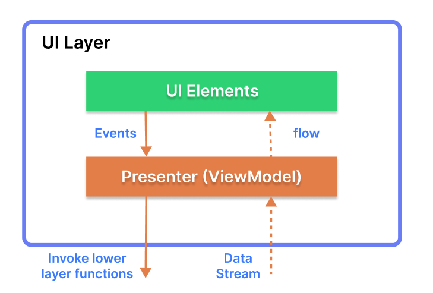

<h1 align="center">RMovies</h1>

<p align="center">
  <a href="https://opensource.org/licenses/Apache-2.0"></a>
  <a href="https://android-arsenal.com/api?level=21"></a>
  <a href="https://github.com/osvaldo-esparza"></a> 
</p>


This is a sample application built using Kotlin, following the MVVM architecture pattern. It leverages various Android components such as ViewModel, LiveData, and DataBinding. The app fetches data from the TMDB and displays information about movies in two languages (English or Spanish MX) depends of the current language on the device.
<div style="display: flex; flex-direction: row; align: center">


</div>

<div style="display: flex; flex-direction: row; align: center">


</div>


## Download
Go to the [Releases](https://github.com/osvaldo-esparza/Movies/releases) to download the latest APK.


#### Features

- Fetches movies data from the TMDB API using Retrofit.
- Implements a clean architecture pattern with MVVM, separating concerns between UI, data, and business logic.
- Utilizes Coroutines for asynchronous programming and network operations.
- Implements RecyclerView and CardView for displaying lists of characters.
- Utilizes Glide for image loading and caching.
- Implements navigation using Fragment transactions.

#### Libraries Used

- [Retrofit](https://square.github.io/retrofit/): A type-safe HTTP client for Android and Java.
- [Coroutines](https://developer.android.com/kotlin/coroutines): Provides asynchronous programming with Kotlin.
- [ViewModel](https://developer.android.com/topic/libraries/architecture/viewmodel): Stores and manages UI-related data in a lifecycle-conscious way.
- [LiveData](https://developer.android.com/topic/libraries/architecture/livedata): An observable data holder class.
- [DataBinding](https://developer.android.com/topic/libraries/data-binding): Binds UI components in your layouts to data sources in your app.
- [Glide](https://github.com/bumptech/glide): An image loading and caching library for Android.

<br>

## Architecture
**TMDB** is based on the MVVM architecture and the Repository pattern, which follows the [Google's official architecture guidance](https://developer.android.com/topic/architecture).


### UI Layer



The UI layer consists of UI elements to configure screens that could interact with users and [ViewModel](https://developer.android.com/topic/libraries/architecture/viewmodel) that holds app states and restores data when configuration changes.
- UI elements observe the data flow via [DataBinding](https://developer.android.com/topic/libraries/data-binding), which is the most essential part of the MVVM architecture. 

### Data Layer


The data Layer consists of repositories, which include business logic, such as querying data from the local database and requesting remote data from the network. It is implemented as an offline-first source of business logic and follows the [single source of truth](https://en.wikipedia.org/wiki/Single_source_of_truth) principle.<br>

**TMDB** is an offline-first app is an app that is able to perform all, or a critical subset of its core functionality without access to the internet. 
So users don't need to be up-to-date on the network resources every time and it will decrease users' data consumption. For further information, you can check out [Build an offline-first app](https://developer.android.com/topic/architecture/data-layer/offline-first).

## Modularization


**TMDB** adopted modularization strategies below:

- **Reusability**: Modulizing reusable codes properly enable opportunities for code sharing and limits code accessibility in other modules at the same time.
- **Parallel Building**: Each module can be run in parallel and it reduces the build time.
- **Strict visibility control**: Modules restrict to expose dedicated components and access to other layers, so it prevents they're being used outside the module
- **Decentralized focusing**: Each developer team can assign their dedicated module and they can focus on their own modules.

For more information, check out the [Guide to Android app modularization](https://developer.android.com/topic/modularization).

## Open API


TMDB using the [TMDB API](https://www.themoviedb.org) for constructing RESTful API.<br>
TMDB provides a RESTful API interface to highly detailed objects built from thousands of lines of data related to TMDB.

## Find this repository useful? :heart:
Support it by joining __[stargazers](https://github.com/osvaldo-esparza/Movies/stargazers)__ for this repository. :star: <br>
Also, __[follow me](https://github.com/osvaldo-esparza)__ on GitHub for my next creations! 🤩

# License
```xml
Designed and developed by 2024 osvaldo-esparza 

Licensed under the Apache License, Version 2.0 (the "License");
you may not use this file except in compliance with the License.
You may obtain a copy of the License at

   http://www.apache.org/licenses/LICENSE-2.0

Unless required by applicable law or agreed to in writing, software
distributed under the License is distributed on an "AS IS" BASIS,
WITHOUT WARRANTIES OR CONDITIONS OF ANY KIND, either express or implied.
See the License for the specific language governing permissions and
limitations under the License.
```


#### Acknowledgements

Special thanks to the developers of the TMDB API for providing the data used in this project.

#### About the Developer

This app was developed by Osvaldo Esparza. You can find more of my work on [GitHub](https://github.com/osvaldo-esparza) and [LinkedIn](https://www.linkedin.com/in/osvaldo-esparza-saucedo/). Feel free to reach out if you have any questions or inquiries!
